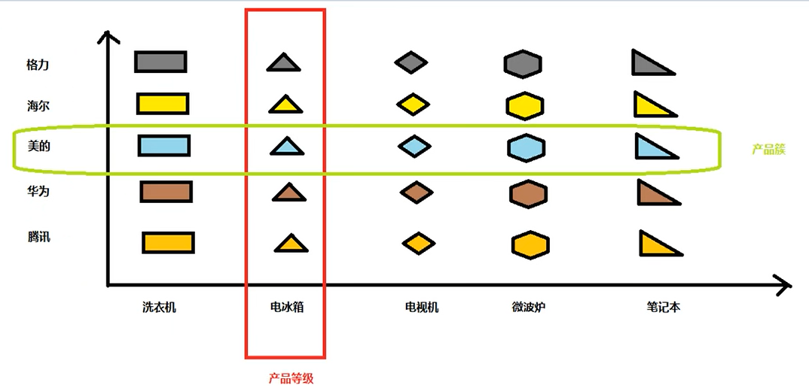
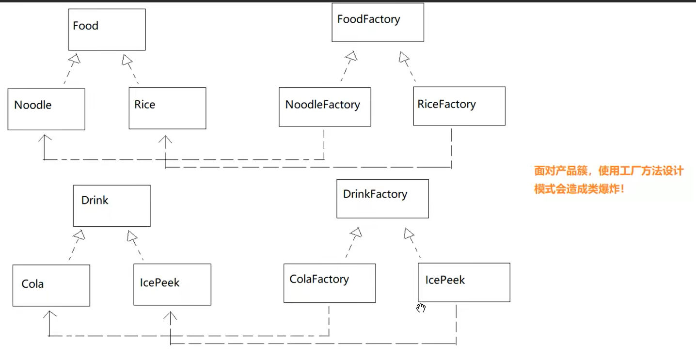
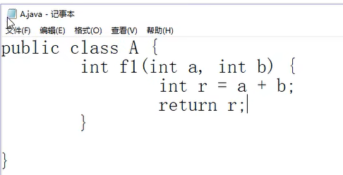
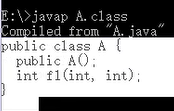
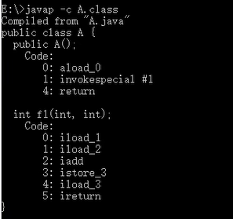
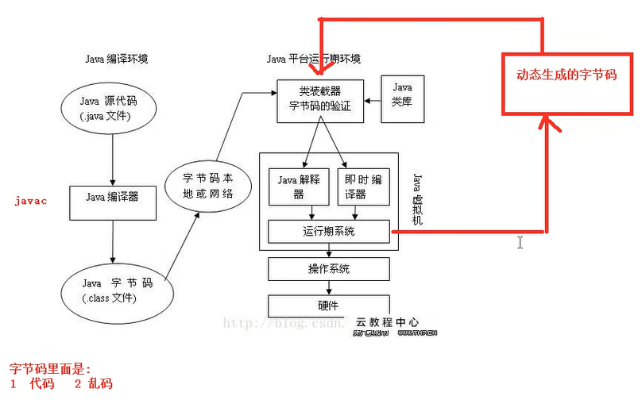

#设计模式

##1.设计模式概述
```text
1.1 目前公认的常用的设计模式有23种，分别对应不同的应用场景。
1.2 开发者分为两类：
        作者：服务器端开发者
        用户：客户端开发者
    开发时注意区分身份
```
##2、七大设计原则（分）
* a.单一职责原则
```text
每一个方法、类、框架只负责一件事情。
```
* b.里氏替换原则<br>
```text
任何能使用父类对象的地方，都应该能透明地替换为子类的对象。
即子类对象可随时随地地替换父类对象，替换完成后，语法与业务逻辑不会报错。
```
* c.依赖倒置原则
```text
上层不应该依赖下层，而应该依赖抽象。
```
* d.开闭原则 
```text
对扩展新功能开放
对修改原有功能关闭（保持原有功能的稳定）
```
* e.迪米特法则（最少知道原则）<br>
```text
定义：最少知道原则。一个类对其他类，知道的越少越好（封装）。

要求对象只和朋友通信。
什么是朋友？
    1.类中的字段
    2.方法的参数
    3.方法的返回值
    4.方法中实例化出来的对象
    
类的设计上体现迪米特法则：
    1.优先考虑将一个类设置为不变类；
    2.尽量降低一个类的访问权限；
    3.谨慎使用 Serializable；-- 
    4.尽量降低类成员的访问权限；

```  
* f.接口隔离原则
```text
客户端不应该依赖不需要的接口，一个类对另一个类的依赖应该建立在最小的接口上
使用多个单一的接口比使用一个总的接口要好（分）
定义的接口的方法一定是所有实现者通用的，将接口的职责隔离，将不通用的属性单独定义进行隔离。
```
* g.组合优于继承原则<br>
```text
关联优于继承
如果父类与子类作者不是同一个人，慎用继承，应该使用组合；
因为父类作者不知道未来的用户，会重写自己的什么方法。
子类的作者不知道父类的作者会在未来的版本里修改、添加什么方法；
```

##3、类与类之间的关系
* 依赖
```text
表示：虚线箭头（依赖方指向被依赖方，被依赖方不知道）
定义：若a类作为b类的局部变量，那么b依赖a。
```
* 继承
```text
表示：实线三角
判断两个类之间是否有继承关系：
    1.主要看两个类是否有 ”is a“关系；
    2.是否满足里氏替换原则；
以上只是原则，不是强制语法，装饰器模式可以违反该原则
```  
* 关联（组合+聚合）
```text
表示：实线箭头
定义：若a作为b的属性变量（字段），那么b关联a；
关联可以细分为组合与聚合。
    组合：
        强关联关系，无法分离（大雁与翅膀）
        实心菱形箭头
    聚合：
        若关联关系（大雁与雁群）
        空心菱形箭头
```

##4、类的实例化过程
执行顺序：静态代码块 > 静态成员变量 > 代码块 > 成员变量 > 构造器 <br/>
注：若为相同类型的代码块，按照代码顺序执行
```text
注：
    类中的实例成员，等价于构造代码块；
    类中的静态成员，等价于静态块；
```

## 5.面向接口编程
### 1.定义
```text
1.每个模块负责自己的职责（单一职责），各个模块之间通过接口隔离。
2.每个模块都应该“承诺”自己对外暴露的接口是不变的；
  当内部发生变化时，调用者是不需要知道的；
  这便是依赖抽象而不依赖与实现。（依赖倒置原则）
3. 上层模块只需要知道下层模块暴露出来的接口即可，至于实现细节不知道也不应该知道；（迪米特法则）
```
## 6.设计模式详解
### 6.1 工厂模式
**基本概念：**
```text
1.产品
    类
2.抽象产品
    抽象类
3.产品簇
    多个有内在联系，或者是有逻辑关系的产品。
    例如：
        KFC工厂中汉堡包与可乐；
        老街烧烤中烧烤与啤酒；
        6mm螺丝与6mm螺母是同一产品簇，8mm螺母与8mm螺丝是同一产品簇；
4.产品等级
    产品类型相同的一系列产品。
```
产品簇与产品等级示意图：

#### 6.1.1 简单工厂模式
***优点：***<br/>
1. 将具体产品类型，从客户端代码中解耦出来。无需知道具体的产品，工厂中定义常量与产品的映射关系，通过常量获取。
2. 服务器端如果修改了具体的产品类名，客户端也知道；
3. 工厂可以对我们创建的一些对象进行加工，而客户端并不知道，因为工厂隐藏了这些细节，如果没有工厂的话，那我们每加一个具体产品，就需要自己在客户端上写这个逻辑，
   本来可以在工厂中生产的东西，我们拿来自己制作，不仅麻烦更不易维护。
注：服务面向接口编程<br/>
   
***缺点：***<br/>
1. 客户端不得不记录具体的常量与具体的映射关系。例如本例中的1:汉堡包 2：过桥米线
2. 如果具体产品特别多，则简单工厂就会变得十分臃肿。比如100个具体的产品，简单工厂中需要写100个映射关系；
3. 最重要的是，**变化**，需要拓展工厂产品时，实现抽象产品后，需要修改简单工厂映射关系的代码（可能没有作者的源代码）；
#### 6.1.2 工厂方法设计模式
***优点：***
1. 任然具备简单工厂的优点；修改了具体的产品类名后，客户端无需知道；
2. 当客户端需要新增一个产品后，不需要修改服务端工厂代码，只是扩展一个新的工厂；

***问题点：***
```text
问题一：
    我们已经知道，简单工厂也好，工厂方法也好，都有一个优点，就是服务器端的具体产品类名变化以后，客户端不知道也无需知道；
但是，简单工厂客户端任然需要知道工厂的类名，如果服务端的产品工厂类名变化，客户端也需要随之修改！一切都回到简单工厂原点！！！
解释：
    工厂名称，是视为接口的。作者应该保证工厂名称是稳定的，至少比产品名更加稳定。
    
问题二：
    既然产品是我们自己客户端扩展出来的，为什么不直接实例化？自己扩展的产品可以自己管控类名。
解释：
    作者在开发功能时，不仅仅是开发一些抽象产品、具体产品和对应的工厂，还会搭配一些提前做好的框架（业务功能），因此在复用时通过工厂类动态调用。
    
问题3：
    示例中，Business.taste() 接收的是工厂，为什么不直接传递 Food ？
解释：
    如果参数为一个Food，那么所有操作只能对同一个具体的对象，例如：所有的评委是吃同一个汉堡包。
```
***缺点：***
1. 如果有多个产品等级，工厂类的数量会越来越多，例如类图所示：

#### 6.1.3 抽象工厂设计模式
适用于产品等级多的场景</br>
***优点：***
1. 任然有简单工厂和抽象工厂的优点；
2. 更重要的是，抽象工厂把工厂类的数量减少了！无论有多少个产品等级，工厂只有一套！
***注意：***
1. 抽象工厂中，可以生产多个产品，多个产品之间，必须存在内在联系；
2. 同一个工厂中的产品都属于同一个产品簇，不能把不同产品簇中的产品混合到一个工厂中；
***缺点：***
1. 当产品等级发生变化时（增加、删除产品），需要修改所有的抽象工厂的实现类。违反了开闭原则。
例如：如果多了一个表演节目产品，那么所有的以前的工厂代码都需要添加节目表演。

结论：
1. 当产品等级比较固定时，可以考虑使用抽象工厂，如果经常变动，则不适合。

### 6.2 原型模式
**基本概念：**
```text
分类：
    创建型设计模式。
定义：
    允许一个对象再创建另外一个对象，根本不需要知道如何创建的细节。
用原型实例指定创建对象的种类，通过深拷贝这些原型实现创建新的对象。

实现方式：
    通过深克隆实现，会破坏单例模式。
    深克隆的实现方式：
        1.实现 Cloneable 接口，重写 clone 方法，修改作用域修饰符。
        2.实现 Cloneable 和 Serializble ，重写 clone()，通过序列化和反序列化复制对象；
```
### 6.3 建造者模式
**基本概念：**
```text
分类：
    创建型设计模式。
```
### 6.4 模板设计模式
**基本概念：**
```text
分类：
    行为设计模式。
定义：
    将共有的方法抽出，做成公共模板，将变化步骤作为抽象，由子类实现。
    子类只能决定一个或多个细节，模板和顺序等已经决定。
使用场景：
    步骤较为稳定，细节不同。
```
### 6.5 适配器设计模式
**基本概念：**
```text
定义：
    将一个类的接口转换成客户端希望的另一个接口，让那些接口不兼容的类可以在一起工作。
```
### 6.6 策略模式
**基本概念：**
```text
分类：
    行为设计模式。
定义：
    分离算法，选择实现。
    将一组算法封装到具有共同接口的独立的类中做成一个算法簇，使得簇的算法可互换代替。
    在抽象的决策类中关联接口，在具体的子类中决定需要执行的算法。
    同时，一个类的行为或其算法可以在运行时更改（例如游戏角色中途获得技能）。
    能够很好的解决有很多 if-else 场景问题
    
```
### 6.7 代理模式
**基本概念：**
```text
分类：
    行为设计模式。
定义：
    为其他对象提供一种代理以控制这个对象的访问。
    在某些情况下，一个对象不适合或者不能直接引用另一个对象，而代理对象可以在客户端和目标对象之间起到中介作用。


```
注意：
1. 代理模式中，代理对象和他所包裹的目标对象，必须实现相同的接口；适配器模式中，适配器和他所包裹的对象不用实现相同的接口；
2. 代理模式中，代理对象可以控制它所包裹的目标对象的方法是否执行！适配器一定会调用被适配对象的方法（主要目的是使两个功能适配在一起）；
3. JDk 的动态代理要求被代理的目标对象必须有实现的接口，否则无法使用JDK动态代理；
   如果还是需求使用动态代理，可以使用 cglib!


## 7.拓展知识
### 7.1 面向对象的3大特点是什么？都有什么含义？
- 封装
- 继承
- 多态

### 7.2 JAVA 中创建类的方式有几种？
四种，分别为：new、反射、克隆、序列化

### 7.3 线程阻塞的原因？
1. 获取锁，得不到，快进入了等待锁的阻塞队列；
2. 正在占有锁的线程，调用了 wait()，就进入了 wait阻塞队列；
3. 正在执行中的线程，调用了 sleep() 或者 IO，就进入了另一个阻塞队列；
### 7.4 wait() 方法的作用？
1. 释放CPU
2. 释放锁
3. 唤醒等待锁的线程（不会唤醒因为调用 wait()而等待的线程 ）

线程锁说明：
```text
1. 一个线程占有锁以后，cpu资源仍然会被抢走。
   只有占有锁的线程，在释放锁时会唤醒阻塞队列中（锁池）的线程。
   notify() 不会唤醒该队列中的线程。
2. 当其他线程抢走cpu后，发现获取不到锁对象后会进入阻塞状态，并且进入由于获取不到锁而阻塞得阻塞队列中。
   只有notify()能够唤醒 wait阻塞队列中的线程。（等待池）
3. 当占有锁得线程释放锁的时候，就会立即唤醒等待对象锁的其他线程（都在阻塞队列中）
上面所说的释放锁，包括了所有释放锁的情况：
    a.线程退出同步块
       synchronized(obj){ //线程进入同步块时，会尝试获取锁
       
       } //线程退出同步块时，会释放占有的对象锁，且唤醒其他等待锁的线程
    b.线程调用了wait方法时，会释放 cpu 释放锁，因为 wait 也会引起锁的释放，而一旦释放锁，也就会立即 
```

### 7.5 java 文件编译与反编译？
手动编译：

```shell
javac ***.java
```
编译后为字节码文件 ***.class <br/>
***手动反编译：***
```shell
javap ***.class
```

或者
```shell
javap -c ***.class
```


### 7.6 jvm类加载过程？
